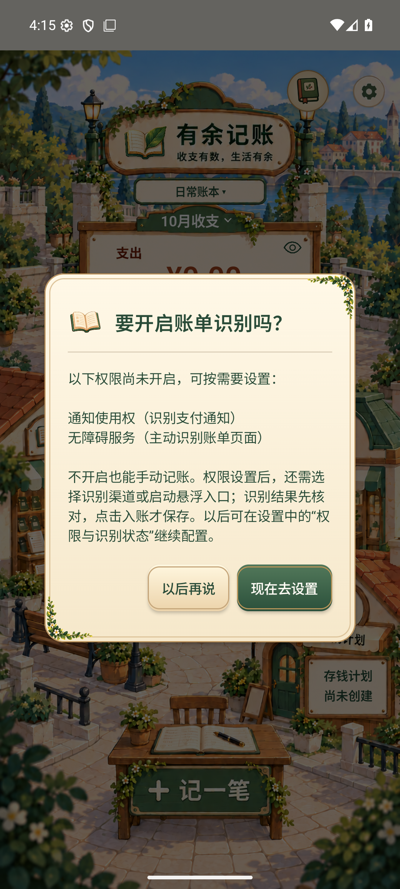

# 有余记账

**收支有数，生活有余。** 让日常账目成为手绘小镇里的一本生活记录。

Android 本地记账应用：手动入账、通知识别、图片补记与主动悬浮识别，共用“先核对、再入账”的流程。本仓库提供安装包与说明，暂不公开源码。

> 当前版本 **v0.2.4 · 首次引导完善**：先看操作指南，回到首页后再按需设置识别权限，两步都可跳过。详见 [本次发布说明](docs/RELEASE_v0.2.4.md)。

---

## 下载

| 平台 | 安装包 | 大小 | 说明 |
| --- | --- | --- | --- |
| Android 8.0+ | **[⬇ youyu-v0.2.4.apk](https://github.com/lyq-05/youyu-ledger/releases/download/v0.2.4/youyu-v0.2.4.apk)** | 88.7 MB | 点击直接下载，无需 root |

[查看 Releases 与历史附件](https://github.com/lyq-05/youyu-ledger/releases)。旧版说明尽量保留，没有可用附件的版本不提供下载链接。

**安装步骤**

1. 下载 APK，在手机文件管理器中打开。
2. 如系统提示，允许当前来源安装应用，再继续安装。
3. 同签名体验版可直接覆盖；升级前请在设置中导出本地备份。若签名冲突，不要直接卸载。
4. 首次进入可查看指南，或跳过后开始手动记账。

---

## 界面

截图来自独立指南应用，仅使用虚构数据。

| 首页 | 操作指南引导 | 权限引导 |
| --- | --- | --- |
|  |  |  |

## 功能

| 功能 | 说明 |
| --- | --- |
| 日常入账 | 选择账本、收支类型、分类与金额，账户可选 |
| 自动识别 | 按渠道开启通知识别；结果先进入待核对流程 |
| 历史补记 | 主动点击悬浮入口读取账单页，或从图片补记 |
| 流水与统计 | 月、年和自选日期统计，账户筛选与分类预算 |
| 账户与资金 | 转账、还款与退款；退款按退款日冲减支出 |
| 存钱计划 | 本地目标与分配记录，支持归档，不涉及真实划款 |
| 数据管理 | 本地备份恢复、自定义 CSV 导入、回收站恢复 |
| 桌面组件 | 快捷记账、收支预算与存钱愿望，金额默认隐藏 |
| 动态首页 | 同步微风与小鸟；可在设置中开启减少动态效果 |

## 权限说明

| 权限 | 用途 | 是否必须 |
| --- | --- | --- |
| 通知使用权 | 读取所选渠道的支付通知 | 手动记账不需要 |
| 悬浮窗 | 显示识别入口和相关小窗 | 按需开启 |
| 无障碍服务 | 用户主动启动的账单页面读取 | 悬浮识别按需开启 |

首次引导不会自动申请以上权限。点击“现在去设置”后，在权限与识别状态页逐项配置。应用清单移除了联网权限；图片识别在本机进行。账务与备份保存在本机，请妥善保管明文导出文件。

## 常见问题

**不设置权限能记账吗？** 可以，手动入账不依赖通知或无障碍权限，付款／收款账户也可暂不选择。

**为什么没有识别成功？** 检查渠道开关、对应权限和系统后台限制；不是所有通知或页面都包含完整账单字段，可改用图片补记或手动录入。

**首页动态卡顿怎么办？** 在“设置 → 首页动态”开启“减少动态效果”。

**这是正式版吗？** 当前为开发体验版，使用调试签名。真实支付通知、页面读取、厂商后台策略及动画真机流畅度、耗电和温升仍需验证。识别结果需要核对后入账；自定义 CSV 导入不等于兼容支付宝或微信的原始导出文件。

## 版本历史

见 [CHANGELOG.md](CHANGELOG.md)，逐版说明如下：

| 版本 | 主题 |
| --- | --- |
| [v0.2.4](docs/RELEASE_v0.2.4.md) | 首次引导顺序与发布说明 |
| [v0.2.3](docs/RELEASE_v0.2.3.md) | 首页同步微风与小鸟动态 |
| [v0.2.2](docs/RELEASE_v0.2.2.md) | 花草边角与更新说明 |
| [v0.2.1](docs/RELEASE_v0.2.1.md) | 首页标志与版本信息 |
| [v0.2.0-preview](docs/RELEASE_v0.2.0-preview.md) | 本地功能与图文指南完善 |

反馈问题时请遮挡订单号、账号等个人信息，不要将真实账单上传到公开 Issue。
